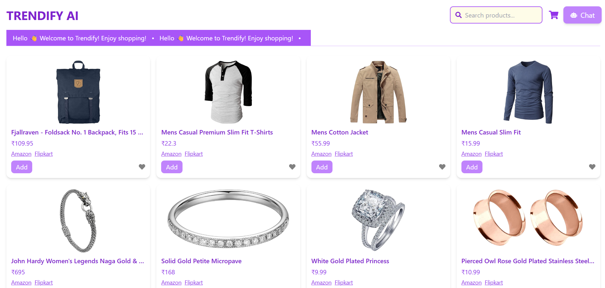
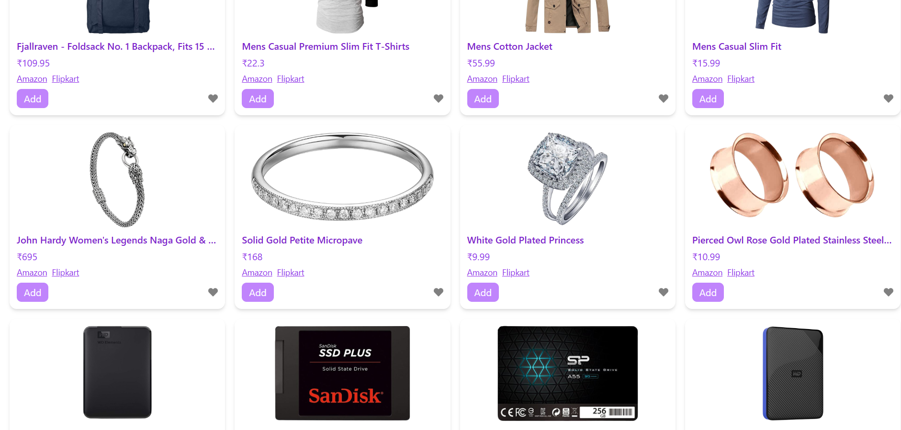
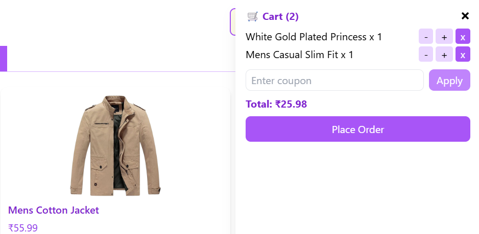
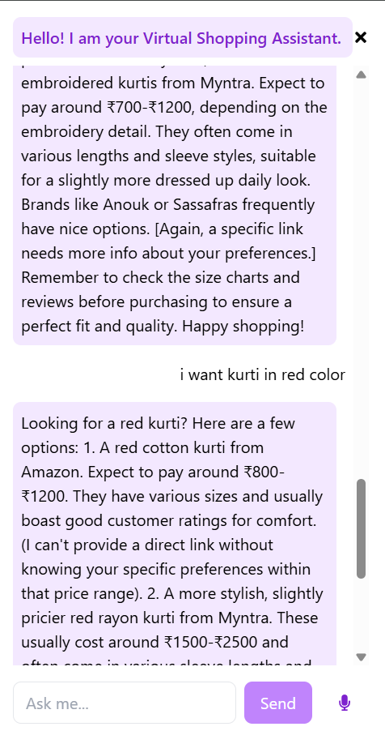

# 🛍 Trendify AI – Virtual Shopping Assistant  

## 1. Background  
In today’s world of e-commerce, customers face challenges in choosing products that match their style, budget, and preferences. While online stores provide massive catalogs, they lack personalized guidance.  
To address this gap, we developed *Trendify AI*, a virtual shopping assistant powered by AI.  
It combines *LLMs (Google Gemini API)* with a modern frontend to deliver a personalized, engaging, and efficient shopping experience.  

---

## 2. Problem Statement  
Shoppers often:  
- Spend time browsing large product catalogs.  
- Struggle to compare options within budget.  
- Miss discounts or coupons.  
- Lack interactive support while shopping online.  

Our solution: *an AI-driven assistant* that recommends products, manages carts/wishlists, applies coupons, and engages in real-time conversation with the user.  

---

## 3. Approach  

1. *Conversation & Information Gathering* – The chatbot engages with the user to understand preferences (budget, product category, style, etc.).  
2. *Information Extraction* – Extracts structured information from user queries using Gemini AI.  
3. *Personalized Recommendation* – Suggests relevant products via the Fake Store API.  
4. *Shopping Experience* – Supports cart, wishlist, coupon discounts, and voice input for hands-free queries.  
5. *Modern UI* – Provides an interactive React + TailwindCSS interface with smooth animations (Framer Motion).  

---

## 4. System Functionalities  

- *Product Search* – Browse and search items from Fake Store API.  
- *Cart System* – Add/remove/update items with live total calculation.  
- *Wishlist* – Save liked products.  
- *Coupons* – Apply predefined discounts (SAVE10, SAVE20).  
- *AI Chat Assistant* – Powered by Google Gemini API for conversational shopping help.  
- *Voice Input* – Users can speak queries directly.  
- *UI/UX* – TailwindCSS + Framer Motion animations for a modern experience.  

---

## 5. System Architecture  

Trendify AI follows a *client-side React application architecture*:  

- *Frontend (React + TailwindCSS)* – Provides user interface and handles user interactions.  
- *Gemini AI API* – Powers natural conversation, query understanding, and recommendations.  
- *Fake Store API* – Supplies product data for browsing and recommendations.  
- *Environment Config (.env)* – Stores API keys securely.  

```plaintext
trendify-ai/
├── public/              # Static assets (index.html, manifest.json, favicon)
├── src/                 # React components, styles, logic
│   ├── App.js           # Main React component
│   ├── index.js         # Entry point
│   ├── index.css        # Tailwind & custom CSS
│   ├── App.css          # Component styling
├── .env                 # API key (not pushed to GitHub)
├── package.json         # Dependencies & scripts
├── tailwind.config.js   # Tailwind setup
└── README.md            # Documentation

💻 6. Implementation Details
Core Functionalities:

> App.js – Main component integrating product listing, cart, wishlist, and chat.
> Chat Component – Handles user input, voice recognition, and Gemini API responses.
> Cart Component – Manages add/remove/update logic with total calculation.
> Coupon Function – Validates and applies discounts.
> Tailwind + Framer Motion – Provides styling and animation.

Major Functions:

> handleAddToCart() → Adds products to cart
> handleRemoveFromCart() → Removes items
> applyCoupon() → Applies discount codes
> handleChat() → Sends messages to Gemini API and receives responses
> handleVoiceInput() → Converts speech to text for queries

⚙ 7. Installation & Setup

8. Setup
8.1. Clone the repository

git clone https://github.com/<your-username>/trendify-ai.git

Install dependencies

npm install

8.2. Set up environment variables
Create a .env file in the root directory and add your Google Gemini API key:

REACT_APP_GOOGLE_API_KEY=your_api_key_here

8.3. Start the development server

npm start

8.4. Open your browser and visit

http://localhost:3000

📖 9. About

A conversational AI Virtual Shopping Assistant that helps users browse products, manage carts, apply discounts, and interact with an AI assistant for better shopping experiences.

🏷 10. Topics

react · tailwindcss · framer-motion · gemini-api · shopping-cart · wishlist · ai-chatbot

11. Resources

> Fake Store API
> Google Gemini API
> TailwindCSS Docs
> Framer Motion Docs

⭐ Contribution & Support

If you like this project, give it a ⭐ on GitHub!
Contributions are welcome — feel free to fork the repo and submit a PR.

### 🏠 Home Page


### 🔍 Product Browsing


### 🛒 Cart System


### 🤖 AI Chat Assistant


